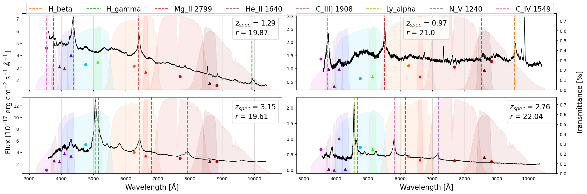

```python
import pandas as pd
import matplotlib.pyplot as plt

from spectrum import make_spec_df, grid_specs
```


```python
broad = ['u', 'g', 'r', 'i', 'z']
broad_colors = ['#CD00CD', '#00C0FF', '#FF6300', '#D20000', '#AA0000']
broad_dict = dict(zip(broad, broad_colors))
narrow = ['J0378', 'J0395', 'J0410', 'J0430', 'J0515', 'J0660', 'J0861']
narrow_colors = ['#610061', '#8000A1', '#7E00DB', '#3D00FF', '#1FFF00', '#FF0000', '#610000']
narrow_dict = dict(zip(narrow, narrow_colors))
filters_dict = broad_dict | narrow_dict

lines = ['H_alpha', 'H_beta', 'H_gamma', 'Mg_II 2799', 'C_III] 1908',
         'He_II 1640', 'C_IV 1549', 'N_V 1240', 'Ly_alpha']
plt_colors = plt.rcParams['axes.prop_cycle'].by_key()['color']
lines_dict = dict(zip(lines, plt_colors))
```


```python
df = pd.read_csv('example.csv')
```


```python
specs = make_spec_df(df.loc[[1, 5, 15, 50]])
grid_specs(df.loc[[1, 5, 15, 50]], specs, lines_dict, True, filters_dict)
```


    

    


```python

```
